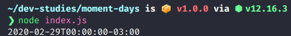

# Moment working w/ leap years days

* start on momen 
```
const moment = require('moment')
const now = moment('2020-03-01').format()
const date = moment(now).subtract(1, 'days').format()
```
* return 

<p align="center">

</p>
